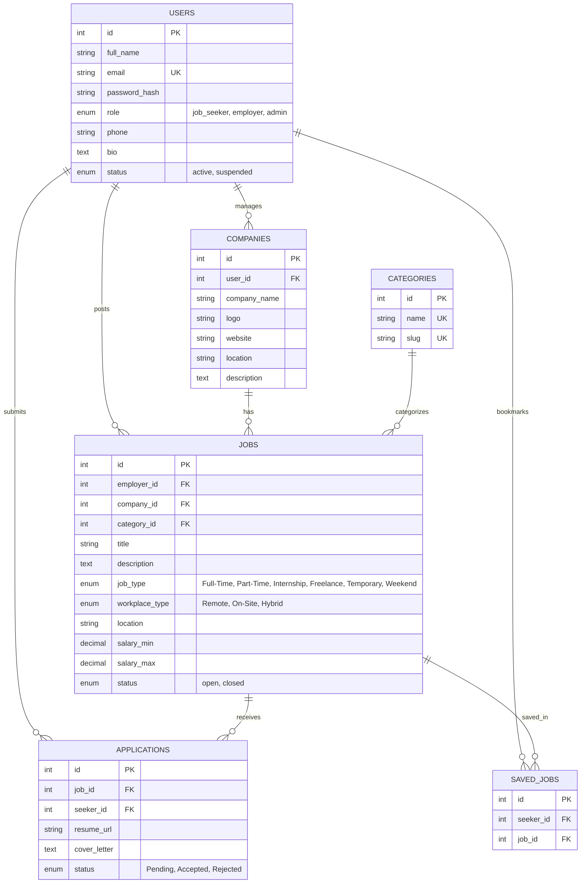

# FlexiHire | Production-Ready Full Stack Job Marketplace

FlexiHire is a full-stack job marketplace connecting Employers and Job Seekers across various work arrangements (Full-Time, Part-Time, Internship, Remote, Hybrid, Freelance, Weekend, and Temporary).

Built using **Node.js, Express.js (MVC Architecture), React, Tailwind CSS, JWT Authentication, and MySQL**.

---

## 🌟 Key Platform Features

### 👤 Job Seeker Features
- **Account Registration & Login**: Role-based signup with encrypted JWT auth.
- **Interactive Job Search**: Filter by Keyword, Location, Category, Job Type, Workplace Model (Remote/Hybrid/On-Site), Experience Level, and Salary.
- **One-Click Application**: Apply with Cover Letter and Resume link.
- **Application Tracking**: Monitor application status (`Under Review`, `Accepted`, `Rejected`) live from the candidate dashboard.
- **Bookmarks & Saved Jobs**: Bookmark positions for quick access and application.
- **Profile Management**: Update contact details and candidate summary.

### 🏢 Employer Features
- **Company Profile**: Manage organization details, logo, website, and location.
- **Job Posting**: Post open listings with rich criteria (salary ranges, experience, workplace type).
- **Listing Management**: Toggle listing status (`Open` / `Closed`) or edit/delete postings.
- **Candidate Evaluation**: Review candidate applications, read cover letters, open resumes, and accept/reject submissions.

### 🛡️ Admin Features
- **User & Employer Moderation**: View all platform accounts with ability to suspend/reinstate users.
- **Job Moderation**: Audit posted jobs and remove fake or inappropriate listings.
- **Platform Telemetry**: View live statistics on active users, companies, and jobs.

---

## 🏗️ Architecture & ER Diagram

### Database ER Diagram


---

## 📁 Folder Structure

```text
felxihire/
├── database/
│   ├── schema.sql           # MySQL database schema definition
│   └── seed.sql             # Mock data seed script
├── server/
│   ├── config/              # MySQL connection pool & dev store
│   ├── controllers/         # MVC Controllers (auth, job, application, saved, employer, admin)
│   ├── middleware/          # JWT auth guard, authorization, global error handler
│   ├── routes/              # Express REST API routes
│   ├── utils/               # JWT helper utilities
│   ├── uploads/             # Static file storage directory
│   ├── .env.example         # Environment template
│   ├── server.js            # Express application entrypoint
│   └── package.json
└── client/
    ├── src/
    │   ├── components/      # Navbar, Footer, JobCard, SearchBar, FilterSidebar, ApplyModal, Loader
    │   ├── context/         # AuthContext, ToastContext
    │   ├── layout/          # MainLayout
    │   ├── pages/           # Landing, SearchJobs, JobDetail, Dashboards, Auth pages
    │   ├── services/        # Axios API client with JWT interceptors
    │   └── App.jsx          # React Router DOM configuration
    ├── vite.config.js
    ├── tailwind.config.js
    └── package.json
```

---

## ⚡ Quick Setup Instructions

### Prerequisites
- Node.js (v18+)
- MySQL Server (Optional - automatic dev fallback store included for zero-friction setup!)

### 1. Backend Setup
```bash
cd server
npm install
cp .env.example .env
npm run dev
```
The server will run on `http://localhost:5000`.

### 2. Frontend Setup
```bash
cd client
npm install
npm run dev
```
The application will open on `http://localhost:5173`.

---

## 🔐 Demo Credentials

| Role | Email | Password |
| :--- | :--- | :--- |
| **Job Seeker** | `seeker@flexihire.com` | `password123` |
| **Employer** | `employer@techcorp.com` | `password123` |
| **Admin** | `admin@flexihire.com` | `password123` |

---

## 🚀 Deployment Guide

### Frontend Deployment (Vercel)
1. Push code to GitHub repository.
2. Import repository in Vercel.
3. Set Root Directory to `client`.
4. Build command: `npm run build`, Output directory: `dist`.

### Backend Deployment (Render)
1. Import repository in Render Web Service.
2. Set Root Directory to `server`.
3. Build Command: `npm install`, Start Command: `npm start`.
4. Set Environment Variables (`JWT_SECRET`, `DB_HOST`, `DB_USER`, `DB_PASSWORD`, `DB_NAME`, `CLIENT_URL`).

### Database Deployment (Railway / PlanetScale)
1. Create a MySQL Instance on Railway.
2. Execute `database/schema.sql` and `database/seed.sql` on the connected MySQL database.
3. Update `DB_HOST`, `DB_PORT`, `DB_USER`, `DB_PASSWORD`, `DB_NAME` in Render.
